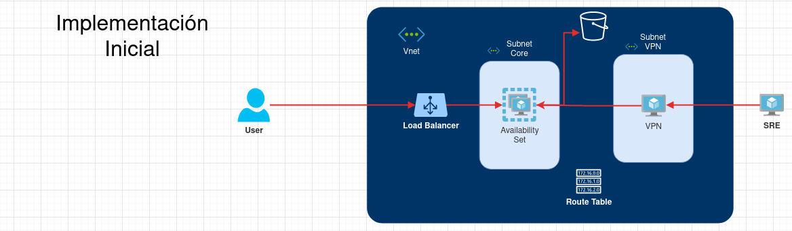
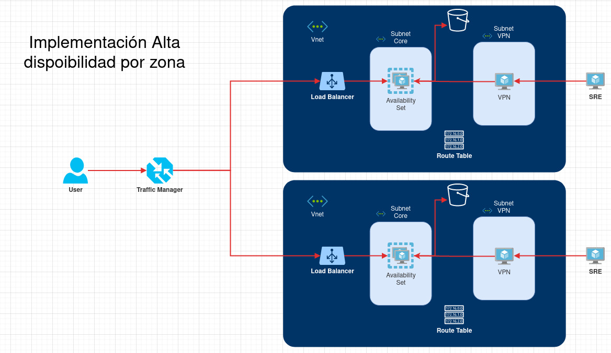
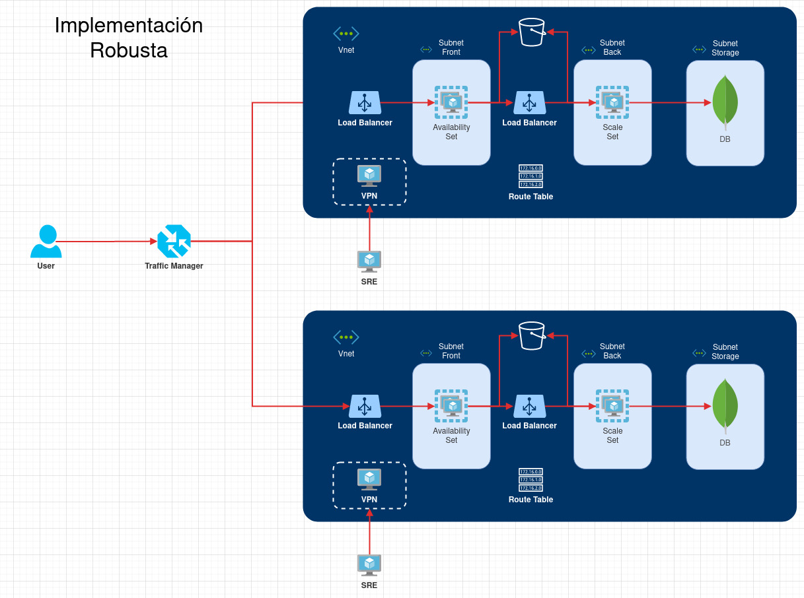
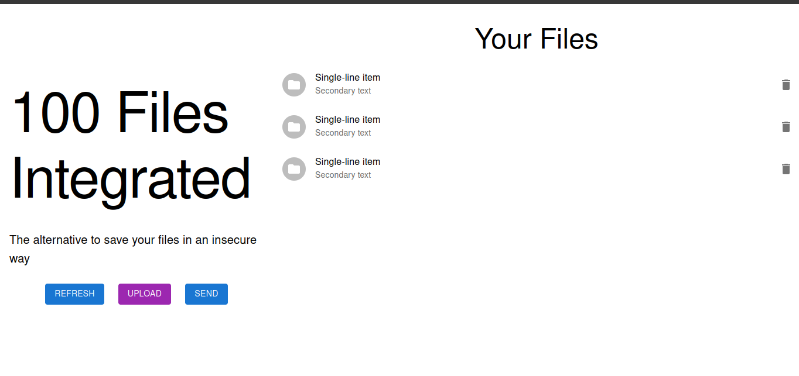

# sd-exam1
---

PageTitle: Parcial 1 - Sistemas Distribuidos - Icesi
author: "Jhonnier Isaza, Juan Camilo Vargas, Juan David Ballesteros"
date: "05/10/2022"
output: html_document

---

## Estrategía de codigo

Se definió trunck base como estrategia de ramas para la contrucción de las aplicaciones. De esta forma todaas las modificaciones se suben directamente a la rama Main en este caso. Se optó por este camino ya que las aplicaciones sencillas en este punto y entre uno y dos desarrolladores solo realizaron ediciones en los proyectos.

Repocitorios
* [Frontend](https://github.com/JuanDavidBallesteros/100Files_front)
* [Backend](https://github.com/Jhonnier20/100FilesBack)

El servicio de la base de datos está en MongoDB corriendo en contenedores dentro de la red

## Infrastructura

Al ser una aplicación sencilla con una afluencia de usuarios minima, cerca de 20 peticiones a la semana se ha decido implementar una infrastrutura sencilla buscando aprovechar recursos como los Availability Sets de Azure, con el fin de mejorar la disponibilidad del servicio.

A medida que la aplicación tome fuerza en el mercado o tenga un mayor flujo de usuarios se se plantea esta segunda versión de la infrastructura en la cual existe redundancia entre zonas, lo que aumenta la disponibilidad y puede mejorar la experiencia de los usuarios.

Finalmente se plantea una infrastructura robusta que ademas de buscar la alta disponibilidad servirá para soportar servicios complejos y de alto costo computacional.

> Las implementaciones mostradas anterirmente son diseñadas bajo el marco de recursos ofrecidos por Azure como proveedor de la nube.

Elementos de seguridad:
- Separación de subredes
- Acceso por medio de VPN
- Uso de loadbalancer para exponer solo el front

## IaC

### Provisionamiento

Como herramienta para el aprovisionamieto en la nube se usó Terraform, en el siguiente enlace pueden encontrar los archivos escritos. [Archivos Terraform.](./IaC/provisioning/)

En la carpeta se encuentran dos carpetas, una llamada launch en la cual se encuentra la importación del modulo y la logica, en esta se encuentran las variables. En la carpeta logic se encuentra la construcción de cada recurso de la infrastructura inicial diseñada.

### Gestión de configuración

Como herramienta de configuración se usó Ansible, en el siguiente enlace pueden encontrar los archivos escritos. [Archivos Ansible.](./IaC/configuration/)

Las llaves usadas estan guardas en secreto, por seguridad. En caso de ser necesario estas llaves deberan ser solicitadas a los autores. En los archivos de configuración existen dos elementos, vpn_serve, el cual contiene la configuración para lanzar una implementación de Pritunl VPN, que permitirá ingresar a la red privada y realizar la gestión. Este servidor se gestiona por una IP publica.

En la carpeta core se encuentra la configuración del servidor principal, en esta se pueden encontrar dos roles, el primero instala git, los repocitorios. El segundo role instala docker para poder correr los contenedores, el archivo de orquestación se encuentra en la carpeta orchestation, el cual corre todos los servicios en una red de contenedores exponiendo los puertos necesarios en el host.

## Cloud provider

Como proveedor de nube utilizamos Azure, teniendo en cuenta la suscripcion que nos otorga por ser estudiantes de la universidad ICESI (Azure for Students). Dicha suscripcion nos otorga 100 creditos para realizar nuestros respectivos montajes.

## Integración

Como herramienta de integración y despliegue se implementó Github Actions. Se realizó la implementación de la construcción de la imagen sin correr test, al finalizar la construcción se realiza la actualización del código en el servidor y el redespliegue de las aplicaciones. A continuación se presentan las evidencias visuales.

 

## Problemas encontrados

### Asignacion de Ip publica al load balancer

En nuestra infraestructura teniamos una ip publica asignada al load balancer, pero al ingresar al Azure portal para conocer la ip que quedaba asignada, nos llevamos la sorpresa de que no aparecia. Debimos leer la documentacion y nos dimos cuenta que se debia realizar una regla de NAT, para decirle al load balanacer por que puerto entrarian las peticiones y por donde saldrian, ademas de esto debiamos configurar hacia donde saldrian las peticiones, en nuestro caso debe apuntar a la maquina donde estan nuestros servicios.

### Cambio de bastion por una VPN

En nuestro diseño incial, se habia pensado en implementar un bastion para acceder a nuestro servidor, pero nos dimos cuenta que el bastion no permite acceder por ssh al servidor, debido a esto se debio replantear el diseño e implementar una vpn, que por medio de esta se nos fuera posible acceder al servidor.

### Subir archivo al bucket

Al inicio se tuvieron problemas al cargar el archivo al frontend para enviarlo al backend, debimos realizar la conversion del archivo a un formato valido para poder ser recibido en el backend, luego de haberlo recibido se debio realizar la correspondiente decodificacion desde el backend para poder hacer el envio al bucket.

### Renderizacion de la lista

Al momento de realizar el llamado en la base de datos para mostrar la informacion de los archivos, se tuvo problemas con el useEffect de React, ya que se generaba un ciclo infinito de peticiones, es por esto que utilizamos un boton de refresh para cargar nuevamente la informacion. 
